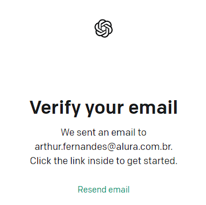

# 13 Para saber mais: criando a conta no OpenAI

Para o desenvolvimento deste curso, vamos utilizar a API do ChatGPT e será necessário ter uma conta na plataforma da OpenAI, que distribui o serviço de geração de texto.

O ChatGPT é um programa de computador criado pela OpenAI que consegue entender e escrever texto em linguagem humana, como um chat ou conversa. É como um assistente virtual que responde às suas perguntas e ajuda em tarefas que envolvem palavras.

Então, vamos criar a conta no [site do OpenAI](https://openai.com/)?
  
### 1 - Para começar, vamos acessar o site do OpenAI, onde vamos nos deparar com a seguinte tela:

###### Imagem de um print de tela da página inicial da OpenAI com destaque em vermelho ao botão "Get Started", localizado no canto superior direito da tela.

E vamos clicar no botão "Get started".

### 2 - Logo após, seremos redirecionados a uma página de cadastro no site, que vai nos dar a opção de fazer cadastro utilizando o email, bem como com as contas Google, Microsoft ou Apple. Vamos preencher o campo de texto destinado ao email e clicar no botão "Continue".

###### Imagem de um print da tela de cadastro do OpenAI, onde são mostradas informações sobre o cadastro, bem como uma caixa de texto, para email, um botão em verde escrito "Continue" e botões para cadastrar-se utilizando as contas do Google, Microsoft ou Apple.

### 3 - Uma vez que preenchemos o email, seremos redirecionados para a segunda parte do cadastro, onde vamos definir a senha da conta. Para avançarmos, vamos definir uma senha segura, na caixa de texto "Password" e em seguida clicar no botão "Continue".

###### Imagem de um print da tela de cadastro do OpenAI após o preenchimento do email, que mostra informações sobre o cadastro, além da confirmação do email preenchido previamente e um campo de senha para definição da senha da conta, seguido de um botão verde escrito "Continue"

### 4 - Com isso, seremos redirecionados a uma página que nos avisa que a OpenAI enviará um email para confirmação da conta, para o endereço de email cadastrado previamente.

###### Imagem de um print da tela de cadastro da OpenAI, após a definição da senha. Na tela, são mostradas informações sobre o cadastro, indicando o envio de um email de confirmação para o email cadastrado, seguido de um botão "Resend email"

### 5 - Ao acessar o email cadastrado e abrir o email enviado pela OpenAI, vamos nos deparar com algo. Onde vamos clicar no botão "Verify email adress", para verificar o endereço de email.

###### Imagem de um print de tela do email enviado pela OpenAI para verificação do email. São mostradas informações sobre a verificação do email e um botão em verde escrito "Verify email address"

### 6 - Após clicar no link, seremos novamente redirecionados para uma página de cadastro da OpenAI, onde são pedidas as informações: primeiro nome, sobrenome, organização (que é opcional) e data de nascimento, como mostrado. Nessa tela, vamos preencher os nossos dados e clicar no botão "Continue".

###### Imagem de um print da tela de cadastro do OpenAI, aberta após a verificação do email cadastrado. São mostrados campos de texto a serem preenchidos com as seguintes informações, respectivamente: primeiro nome, sobrenome, organização e data de aniversário. Em seguida, há um botão em verde escrito "Continue"

### 7 - Em seguida, seremos redirecionados para uma página que pedirá a verificação pelo número de celular. Nessa página, vamos escolher o país, que normalmente já vem pré-selecionado, e preencher o número de celular que receberá um SMS com o código de verificação do número. Após o preenchimento, podemos clicar no botão "Send Code".

###### Imagem de um print da tela de cadastro do OpenAI, após a etapa anterior. É mostrado um texto de verificação de número de telefone, bem como uma caixa seletora de país e um campo de número de telefone a ser preenchido. Logo após, há um botão em verde escrito "Send code"

### 8 - Por fim, vamos verificar a caixa de mensagens do celular com o número cadastrado, pois será enviado um código de confirmação, enquanto estamos sendo redirecionados. Onde vamos preencher o campo com o código recebido via celular.

###### Imagem de um print de tela do cadastro da OpenAI, após o envio do número de telefone para verificação. São mostradas informações sobre a verificação de telefone, bem como um campo para informar o código recebido via SMS, para concluir a verificação.

  

E prontinho, o cadastro no site da OpenAI está criado e estamos prontos para seguir com o curso!

> ####   É importante lembrar que a OpenAI nos disponibiliza **5 dólares** para utilizarmos em seu período de teste e que após a finalização desse período, ou ao término dessa cota gratuita, poderão ser efetuadas cobranças para o uso das ferramentas disponibilizadas pela empresa. Caso a sua cota tenha sido excedida, uma alternativa é criar outra conta da OpenAI, que também terá 5 dólares gratuitos.   